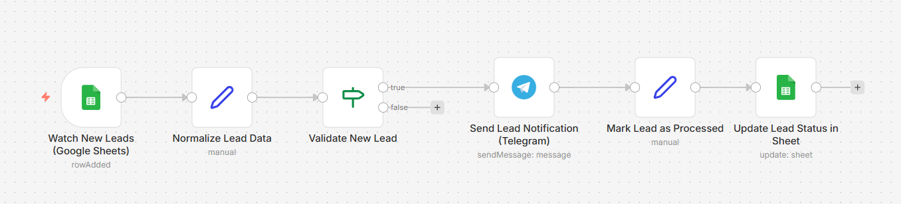

# n8n Lead Notification System

Production-ready n8n automation for processing leads from Google Sheets and sending instant Telegram notifications.

---

## 🚀 Overview

This workflow monitors a Google Sheets table with incoming leads, validates new entries, prevents duplicate notifications, sends formatted messages to Telegram, and marks leads as processed.

The solution is designed without custom backend code and follows clean, production-oriented n8n architecture.

---
## Architecture

## ⚙️ Workflow Logic

1. **Watch New Leads (Google Sheets Trigger)**
   - Triggers on row creation or update
   - Watches specific columns (`status`, `sent`)

2. **Normalize Lead Data**
   - Maps and validates required fields
   - Ensures consistent data structure

3. **Validate New Lead**
   - Processes only leads with `status = new`
   - Skips already processed rows

4. **Send Lead Notification (Telegram)**
   - Sends formatted message with lead details
   - Uses Telegram Bot API

5. **Update Lead Status**
   - Marks lead as `processed`
   - Sets `sent = true` to prevent duplicates

---

## ✅ Features

- Google Sheets as lightweight CRM
- Duplicate notification protection
- Clean conditional logic (no hacks)
- Production-ready node structure
- Easy to extend (Slack, Email, CRM)

---

## 🧰 Tech Stack

- **n8n**
- **Google Sheets**
- **Telegram Bot API**

---

## 📌 Use Cases

- Small businesses
- Landing pages
- Sales teams
- No-backend automation setups

---

## 📂 Repository Contents

- `README.md` — project documentation  
- `workflow.json` — exported n8n workflow (to be added)

---

## 👤 Author

n8n Automation Developer  
Portfolio project
## How to import

1. Download `workflow/lead-notification-system.sanitized.json`
2. In n8n: Workflows → Import from file
3. Configure credentials:
   - Google Sheets
   - Telegram Bot
4. Replace placeholder values:
   - `__GOOGLE_SHEET_ID__`
   - `__TELEGRAM_CHAT_ID__`
5. Activate the workflow
## Production notes

- Idempotent processing (no duplicate notifications)
- Explicit status flag in Google Sheets
- Safe to re-run
- No instance-specific data in public export

